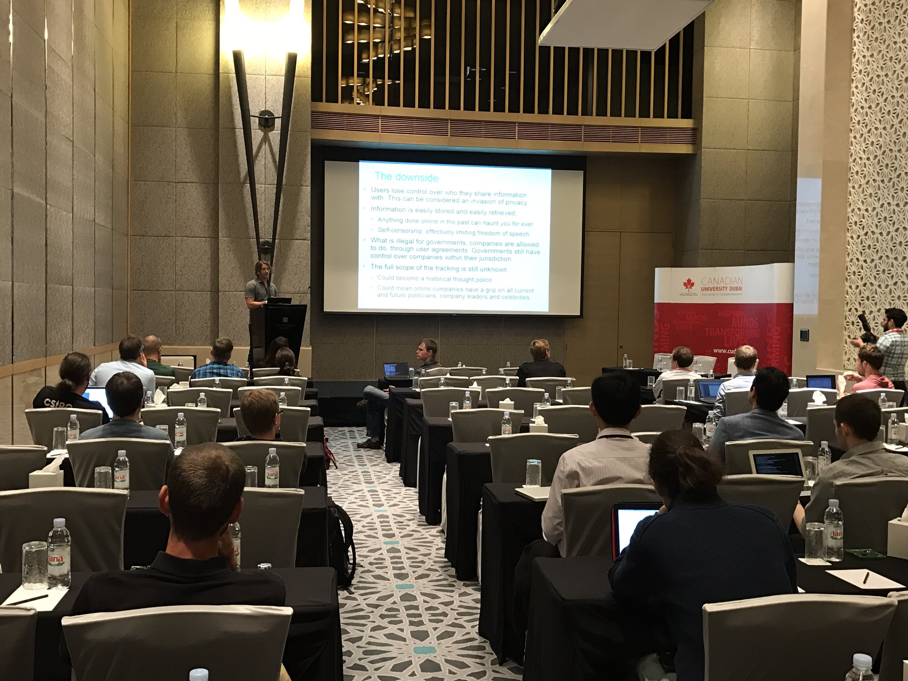

# [More tracked paper](https://github.com/joelpurra/more-tracked-paper)

[](https://twitter.com/IEEELCN/status/795926755982868481)
Niklas Carlsson presenting the paper [*Third-party Tracking: A Swedish Perspective*](https://joelpurra.com/projects/masters-thesis/#ieee-lcn-2016) at IEEE LCN 2016.

This paper is written by [Joel Purra](https://joelpurra.com/) and [Niklas Carlsson](https://www.ida.liu.se/~nikca/). It is based on [Joel Purra's master's thesis](https://joelpurra.com/projects/masters-thesis/).


## Citations

If you use, like, reference, or base work on the thesis report [*Swedes Online: You Are More Tracked Than You Think*](https://joelpurra.com/projects/masters-thesis/#thesis), the IEEE LCN 2016 paper [*Third-party Tracking on the Web: A Swedish Perspective*](https://joelpurra.com/projects/masters-thesis/#ieee-lcn-2016), open [source code](https://joelpurra.com/projects/masters-thesis/#open-source), or [open data](https://joelpurra.com/projects/masters-thesis/#open-data), please add at least on of the following two citations with a link to the project website: https://joelpurra.com/projects/masters-thesis/

[Master's thesis](https://joelpurra.com/projects/masters-thesis/#thesis) citation:

> Joel Purra. 2015. Swedes Online: You Are More Tracked Than You Think. Master's thesis. Linköping University (LiU), Linköping, Sweden. https://joelpurra.com/projects/masters-thesis/


[IEEE LCN 2016 paper](https://joelpurra.com/projects/masters-thesis/#ieee-lcn-2016) citation:

> J. Purra, N. Carlsson, Third-party Tracking on the Web: A Swedish Perspective, Proc. IEEE Conference on Local Computer Networks (LCN), Dubai, UAE, Nov. 2016. https://joelpurra.com/projects/masters-thesis/


## Repository status

*The actual papers submitted/published have diverged from the repository; it can be considered obsolete.*

Decided to put the work in progress online - comments, suggestions and pull requests welcome!

Stay updated by watching this repository.


## Generating `paper.pdf`

Tables and figures are rendered separately from the paper, and then included.


```bash
# Render tables by parsing the tex twice.
pdflatex tables.tex
!!
#open tables.pdf

# Rendering figures/figures-ng requires -shell-escape.
pdflatex -shell-escape figures.tex
#open figures.pdf

pdflatex -shell-escape figures-ng.tex
#open figures-ng.pdf
```


```bash
# Render main paper by parsing the tex twice.
pdflatex paper.tex
!!
open paper.pdf
```


---

Copyright (c) 2014, 2015, 2016, 2017 [Joel Purra](https://joelpurra.com/). Released under the [Creative Commons Attribution-NonCommercial-NoDerivatives 4.0 International (CC BY-NC-ND 4.0)](https://creativecommons.org/licenses/by-nc-nd/4.0/) license.
